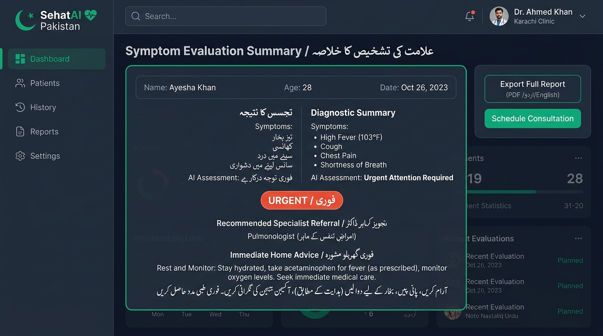
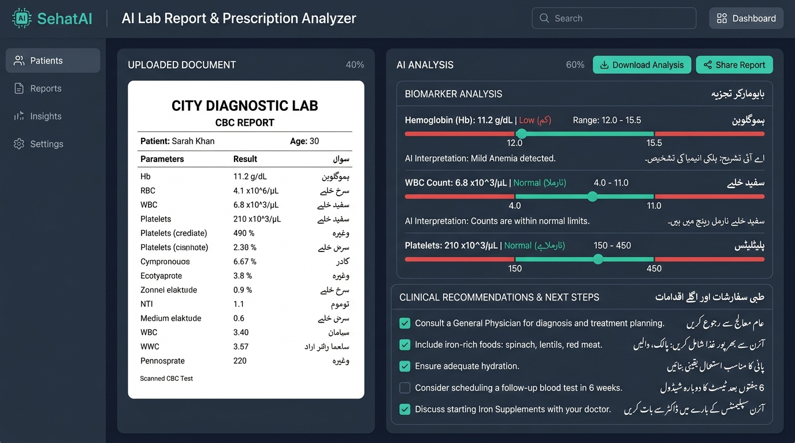
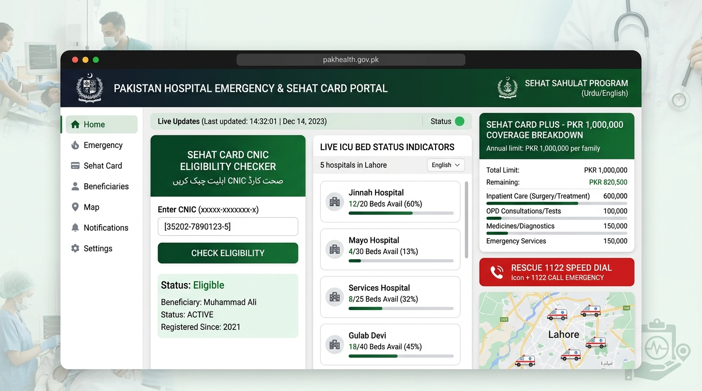

# 🇵🇰 SehatAI Pakistan — AI-Powered Healthcare & Teleconsultation Platform

[](https://sehat-ai-pakistan.vercel.app/)
[](https://react.dev)
[](https://www.typescriptlang.org)
[](https://tailwindcss.com)
[](https://ai.google.dev)
[](LICENSE)

🌐 **Live Website:** [https://sehat-ai-pakistan.vercel.app/](https://sehat-ai-pakistan.vercel.app/)

**SehatAI Pakistan** is Pakistan's premier AI-powered healthcare navigation platform designed specifically for the Pakistani medical ecosystem. It bridges the gap between digital AI triage, PMDC-verified teleconsultations, laboratory report analysis, hospital emergency tracking, and government Sehat Card health insurance coverage.

---

## 🎨 Visual Identity & Aesthetic Principles

* **Pakistani National & Clinical Color Palette:** Framed by a rich slate dark canvas (`#020617` / `#0f172a`) paired with vibrant Emerald Green (`#059669`) and Cyan Teal accents, honoring Pakistani national identity (`🇵🇰`) while maintaining a calm, eye-safe clinical environment for late-night medical usage.
* **Bilingual Typographic Hierarchy:** Built with seamless side-by-side English and Urdu (Nastaliq alignment) support, establishing clear visual hierarchy for patients across urban and rural demographics.
* **Live Emergency Micro-Interactions:** Features animated real-time indicators for 24/7 hospital ER statuses, high-visibility urgency badges (`EMERGENCY` red, `URGENT` orange, `MODERATE` yellow, `LOW` green), and smooth progress animations during AI symptom evaluation.
* **High-Contrast Clean Layout:** Utilizes dark elevated card surface containers, clean 1px border highlights, generous negative space, and responsive touch targets designed for rapid navigation during emergency situations.

---

## 📸 Application Showcase & Feature Screenshots

An interactive showcase of the primary modules powering **SehatAI Pakistan**:

### 🌟 Platform Overview & AI Assistant Portal

* **National Digital Health Portal:** Integrated bilingual healthcare navigation hub serving patients across Pakistan.
* **Instant Triage & Teleconsultation:** Fast access to AI symptom evaluation, verified PMDC doctor bookings, and hospital emergency locator.

---

### 🩺 1. National AI Symptom Triage (اردو / English)

* **Multilingual Triage Engine:** Evaluates medical symptoms submitted in English, Urdu (اردو), or Roman Urdu.
* **Urgency Stratification:** Assigns real-time urgency badges (`EMERGENCY`, `URGENT`, `MODERATE`, `LOW`) with red-flag detection.
* **Clinical Report Export:** One-click tools to copy, download `.txt` reports, print formatted clinical summaries, or routing to PMDC specialists.

---

### 🔬 2. AI Lab Report & Prescription Reader

* **Smart Biomarker Analysis:** Explains laboratory values (CBC, HbA1c, Dengue NS1, Typhoid, LFTs, Lipid Profiles) in patient-friendly terms.
* **Bilingual Translation:** Displays findings side-by-side in Urdu and English with reference ranges.
* **Clinical Action Items:** Provides dietary advice, warning flags, and recommended specialist follow-ups.

---

### 👨‍⚕️ 3. PMDC Verified Doctor Teleconsultations

* **Verified Specialist Directory:** Search 2,500+ PMDC-registered doctors across Karachi, Lahore, Islamabad, Peshawar, Quetta, and Faisalabad.
* **Filter & Schedule:** Sort by medical specialty, consultation fee (PKR), patient ratings, gender, and live video slots.
* **Sehat Card Coverage:** Identifies specialists offering zero-out-of-pocket consultations under government health insurance.

---

### 🏥 4. Hospital Emergency Room & Sehat Card Portal

* **Live ER Telemetry:** Monitors real-time ICU bed availability, ventilator status, and emergency room wait times across major cities.
* **Sehat Card CNIC Verification:** Instant eligibility lookup for PKR 1,000,000 annual family coverage under the Sehat Sahulat Program.
* **Rescue Speed Dial:** Direct hotline triggers for Rescue 1122, Edhi Foundation, and Chhipa Ambulance services.

---

## 🌟 Key Features & Capabilities

### 🩺 1. AI Symptom Triage Assistant (National Health Triage)
* **Bilingual AI Evaluation:** Powered by Google's `gemini-3.6-flash` model, assessing symptoms described in English, Urdu (اردو), or Roman Urdu (e.g., *"Mujhe do din se bukhar aur sar dard hai"*).
* **Regional Disease Context:** Specialized diagnostic awareness for common regional conditions in Pakistan including Dengue Fever, Typhoid, Malaria, Gastroenteritis, Heatstroke, COVID-19, Diabetes, and Hypertension.
* **Urgency Stratification & Badge:** Instant urgency classification (`EMERGENCY`, `URGENT`, `MODERATE`, `LOW`) with red-flag detection.
* **Clinical Export & Share Options:** Export generated clinical triage reports as `.txt` files, print formatted medical reports, or copy report summaries directly to clipboard.
* **Specialist Doctor Referral:** Direct one-click routing to recommended PMDC specialists based on symptom evaluation.

### 🔬 2. AI Lab Report & Prescription Reader (نسخہ / لیب رپورٹ)
* **Smart Medical Document Explainer:** Upload or paste laboratory test results (CBC, HbA1c, Typhoid/Widal/Typhidot, Dengue NS1/Platelets, LFT, Lipid Profile, Urine RE) or prescription photo details.
* **Biomarker Explanation:** Translates complex clinical values into plain Urdu and English explanations with diet, lifestyle, and doctor consultation checklists.

### 👨‍⚕️ 3. PMDC Verified Doctor Directory & Video Consultations
* **2,500+ PMDC Specialists:** Browse and filter verified doctors across Karachi, Lahore, Islamabad, Peshawar, Quetta, Multan, Faisalabad, and Rawalpindi.
* **Advanced Filters:** Search by specialty, city, max fee (PKR), doctor gender, spoken languages (Urdu, Pashto, Punjabi, Sindhi), and Sehat Card panel acceptance.
* **Interactive Booking Portal:** Schedule video calls with instant slot selection and local payment support (JazzCash, EasyPaisa, Bank Cards).

### 🏥 4. Hospital & ICU Emergency Directory
* **Trauma Center Database:** Real-time bed and emergency tracking for premier healthcare institutions (Aga Khan University Hospital, Shaukat Khanum, Mayo Hospital, PIMS Islamabad, Lady Reading Hospital, AKCMH).
* **24/7 ER Specs:** View ICU ventilator availability, trauma unit status, casualty phone numbers, and Sehat Card paneling.

### 💳 5. Sehat Card Plus CNIC Eligibility Checker
* **CNIC Health Insurance Verification:** Check coverage eligibility across Qaumi Sehat Card Punjab, Sehat Card Plus KP, Sehat Sahulat ICT, Balochistan, GB, AJK, and Sindh.
* **Coverage Breakdown:** Details annual family limit (PKR 1,000,000), 100% covered inpatient procedures (Cardiology, Cancer, Dialysis, Maternity, ER Trauma), and 8500 SMS verification instructions.

### 🚨 6. 24/7 Emergency Hotline & Family SOS Dispatcher
* **National Rescue Hotlines:** Direct speed-dial links for Rescue 1122, Edhi 115, Chhipa 1020, Aman Ambulance, and Police 15.
* **City ER Direct Lines:** Rapid casualty contact numbers for trauma centers in all major cities.
* **First Aid & CPR Guide:** Step-by-step Basic Life Support (BLS) instructions in English and Urdu.
* **Family SOS Dispatcher:** One-tap emergency message builder that generates instant WhatsApp and SMS distress messages containing patient name and location details.

---

## 🛠️ Tech Stack & Architecture

| Layer | Technology |
|---|---|
| **Frontend Framework** | React 19, TypeScript |
| **Styling** | Tailwind CSS v4, Lucide React Icons, Motion |
| **Backend Runtime** | Node.js, Express.js |
| **AI SDK** | `@google/genai` (Gemini 3.6 Flash) |
| **Development Tooling** | Vite 6, `tsx` server runner |
| **Production Build** | `esbuild` bundled CJS server (`dist/server.cjs`) |

---

## 🚀 Getting Started

### Prerequisites
* **Node.js**: `v18.0.0` or higher
* **npm** or **bun** / **yarn**
* **Google Gemini API Key** (optional for AI features; fallback mock analysis is available offline)

### 1. Clone the Repository
```bash
git clone https://github.com/fa19m2mr02-creator/SehatAI-Pakistan.git
cd SehatAI-Pakistan
```

### 2. Install Dependencies
```bash
npm install
```

### 3. Configure Environment Variables
Create a `.env` file in the project root (refer to `.env.example`):
```env
GEMINI_API_KEY=your_gemini_api_key_here
PORT=3000
NODE_ENV=development
```

### 4. Run Development Server
```bash
npm run dev
```
Open your browser and navigate to `http://localhost:3000`.

---

## 📦 Scripts

| Command | Description |
|---|---|
| `npm run dev` | Starts the Express backend with Vite HMR middleware on port `3000` |
| `npm run build` | Compiles Vite frontend assets and bundles `server.ts` into `dist/server.cjs` via `esbuild` |
| `npm start` | Runs the compiled production server (`node dist/server.cjs`) |
| `npm run lint` | Runs TypeScript type checking (`tsc --noEmit`) |
| `npm run clean` | Removes build artifacts (`dist/`) |

---

## 📂 Project Structure

```
SehatAI-Pakistan/
├── src/
│   ├── components/          # UI Components
│   │   ├── Header.tsx           # Top navigation bar with language toggle & emergency trigger
│   │   ├── Hero.tsx             # Main hero section with quick triage input & key stats
│   │   ├── AiTriageSection.tsx  # Interactive AI symptom triage portal
│   │   ├── AiLabAnalyzer.tsx    # Lab report & doctor prescription reader
│   │   ├── DoctorDirectory.tsx  # PMDC verified doctor directory & booking modal
│   │   ├── HospitalDirectory.tsx# Hospital & ICU availability finder
│   │   ├── SehatCardSection.tsx # Sehat Card CNIC eligibility checker
│   │   ├── EmergencyModal.tsx   # Emergency 1122 hotlines, First Aid, and Family SOS
│   │   ├── PricingSection.tsx   # Subscription packages & teleconsultation plans
│   │   ├── Testimonials.tsx     # Verified patient & doctor reviews
│   │   └── Footer.tsx           # Footer links & emergency disclaimer
│   ├── data/                # Mock data & localized translations
│   │   ├── pakistanData.ts      # Doctor listings, hospital specs, emergency hotlines
│   │   └── translations.ts      # Bilingual English & Urdu UI text
│   ├── App.tsx              # Root React component
│   ├── main.tsx             # Frontend entry point
│   └── types.ts             # Global TypeScript interface definitions
├── server.ts                # Express server with Gemini API routes
├── package.json             # Project manifests & scripts
├── vite.config.ts           # Vite configuration
└── README.md                # Project documentation
```

---

## 🔒 Security & Medical Disclaimer

> **Disclaimer:** SehatAI Pakistan is an AI-assisted health navigation and triage tool created for informational and educational purposes only. It does NOT provide formal medical diagnoses or replace direct clinical care from a licensed healthcare professional. In any medical emergency, users are instructed to dial **1122** or **115** immediately or visit the nearest hospital emergency room.

---

## 🤝 Contributing

Contributions are welcome! If you'd like to improve SehatAI Pakistan:
1. Fork the repository
2. Create a feature branch (`git checkout -b feature/AmazingFeature`)
3. Commit your changes (`git commit -m 'Add AmazingFeature'`)
4. Push to the branch (`git push origin feature/AmazingFeature`)
5. Open a Pull Request

---

## 📄 License

Distributed under the Apache 2.0 License. See `LICENSE` for details.

---

## 🎯 Our Mission

Our mission is to democratize access to quality, timely, and bilingual healthcare navigation across all provinces and regions of Pakistan. By harnessing advanced generative AI, real-time emergency telemetry, and PMDC doctor networks, **SehatAI Pakistan** strives to eliminate medical triage delays, simplify complex lab reports in Urdu and English, and ensure no family is left without life-saving guidance during critical emergencies.

---

<p align="center">
  <b>Developed with ❤️ for the people of Pakistan 🇵🇰</b>
</p>
